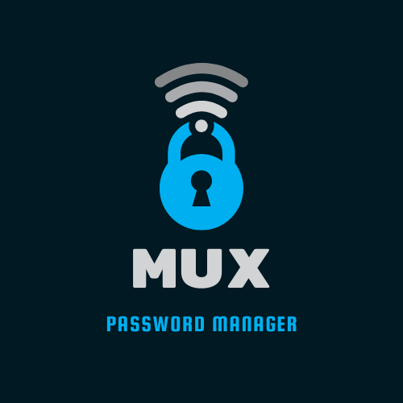
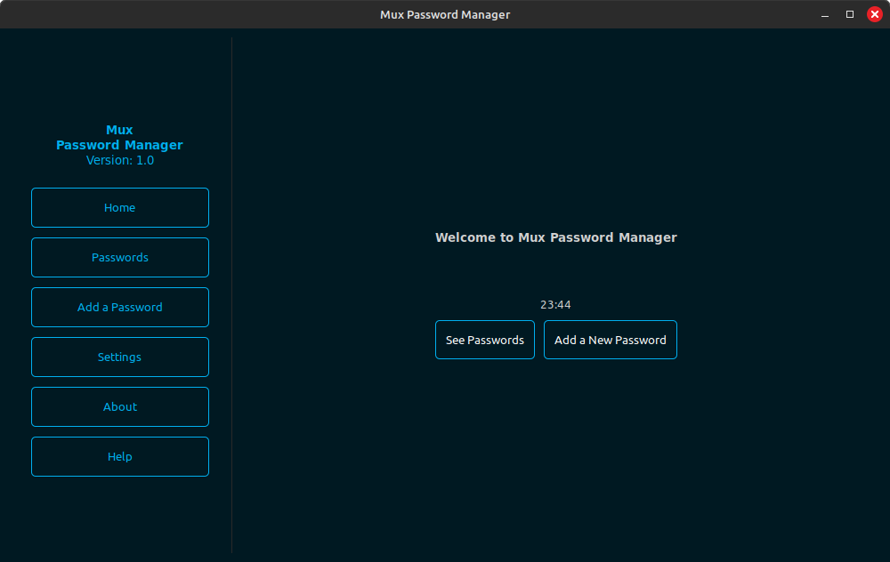
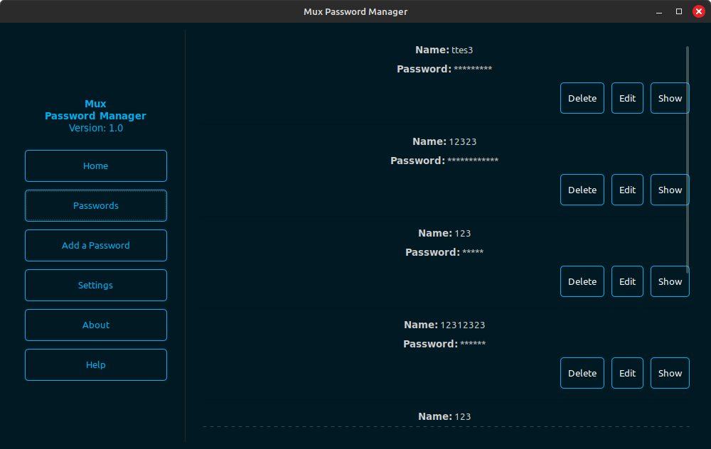
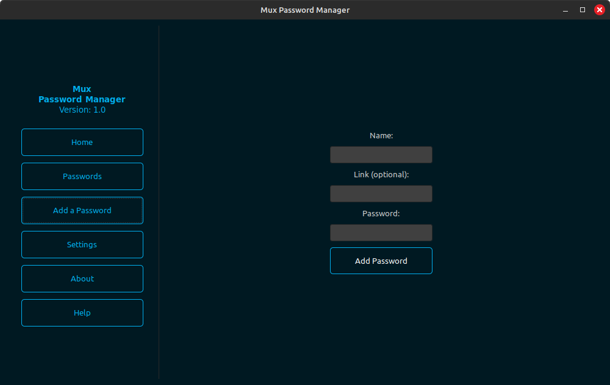

# Mux Password Manager

## Table of concepts
- [Overview](#overview)
  - [Key Features](#key-features)
- [Built with](#built-with)
- [Links](#links)
- [Author](#author)

# Overview

Securely manage your passwords with the Mux Password Manager. This application allows you to store, encrypt, and organize your passwords, ensuring your sensitive information stays safe. Featuring a user-friendly interface built with Python and GTK.

## Key Features:

 - Encryption: Encrypts your passwords for secure storage.

 - Password Management: Add, edit, and delete passwords with ease.

 - Settings: Customize your experience with PIN lock and other settings.

 - Intuitive Interface: Navigate effortlessly with a clean, responsive design.

Keep your passwords organized and accessible while maintaining peace of mind with Mux Password Manager.

## Screenshots
Screenshots are from earlier versions

## Built with
  - Python
  - GTK

## Links
- Website - TBA
- Download - TBA
- Contact - [www.sehic.rf.gd/contact](https://sehic.rf.gd/#contact)

## Author

- LinkedIn - [@Muhammed Šehić](https://www.linkedin.com/in/muhammed-%C5%A1ehi%C4%87-31a7b6175/)
- GitHub - [@MuxBH28](https://github.com/MuxBH28)
- Website - [www.sehic.rf.gd](https://sehic.rf.gd/)
- Contact - [www.sehic.rf.gd/#contact](https://sehic.rf.gd/#contact)
